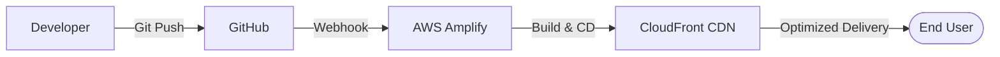

# SunAura Project Architecture

This document describes the high-level architecture of the SunAura web application and its deployment flow.

## 🏗️ Core Architecture

The application is a **Data-Driven React Static Site**. It is designed to be extremely fast, secure, and maintenance-free.

## 💻 Tech Stack

- **Frontend**: React (SPA)
- **Styling**: Tailwind CSS & Craco
- **Deployment**: AWS Amplify (CD Pipeline)
- **Hosting**: AWS S3 + CloudFront (Provisioned by Amplify)
- **SSL**: AWS Certificate Manager (Free TLS)

## 💾 Data Management
The site uses a **Centralized Config System**. All product details, category information, and contact settings are stored in `frontend/src/data/website-config.js`. This allows content updates without a database, keeping the infrastructure cost at **$0**.

## 🚀 Scalability
By using AWS Amplify, the site is globally distributed. If 1,000 customers visit at once, the AWS CDN handles the load effortlessly without any dedicated server management.
